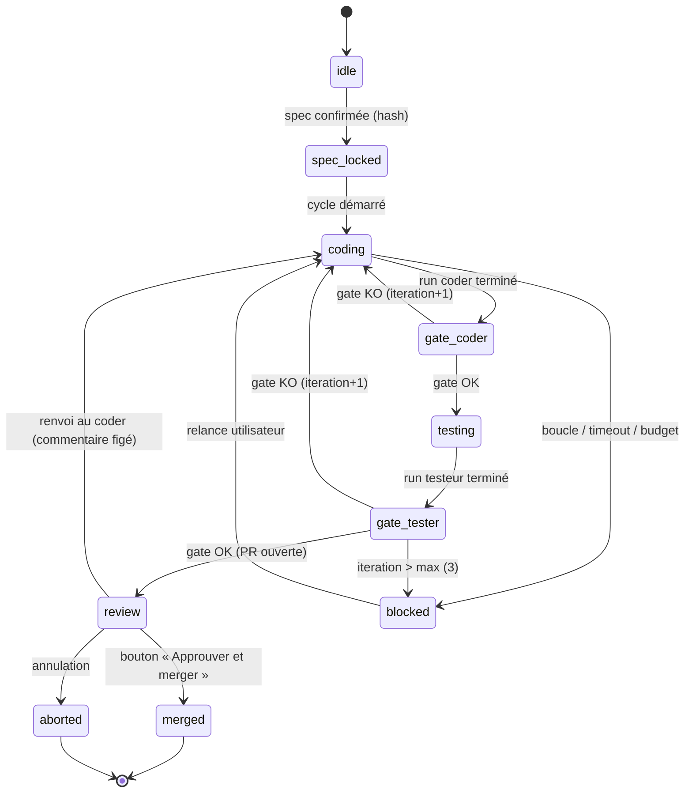

# roue-libre

Orchestrateur local qui pilote trois rôles Claude Code — **Prompteur / Coder / Testeur-Merge** — sur n'importe quel repo cible, avec une machine d'états à **gates objectives** et un **dashboard web temps réel**. Aucune transition n'est décidée par un agent : les agents travaillent, le moteur vérifie par des preuves (scripts shell à exit code) et c'est lui qui fait avancer l'état.

## Quickstart

Installation (depuis les sources) :

```bash
git clone https://github.com/elonmust26/roue-libre.git
cd roue-libre
npm ci
npm run build
npm link   # expose la commande `roue`
```

Puis, dans le repo cible à orchestrer :

```bash
roue init                                # crée .orchestration/ + CLAUDE.md cible + config locale
roue task "ajouter un endpoint /health" \
  --success "GET /health répond 200 avec {ok:true}" \
  --risk low
roue start                               # serveur + dashboard sur http://localhost:4700
```

Commandes utiles :

```bash
roue start --simulate   # démo complète du cycle sans consommer un seul token
roue status             # état courant de la tâche, lisible en terminal
```

Le dashboard écoute par défaut sur le **port 4700** (configurable). La tâche se crée aussi depuis l'écran « Création de tâche » du dashboard ; le critère de succès y est obligatoire, et le lancement reste grisé tant que la spec générée n'est pas confirmée.

## Machine d'états



Version ASCII :

```
idle → spec_locked → coding → gate_coder → testing → gate_tester → review → merged
                       ▲          │                      │            │
                       │          │ gate KO              │ gate KO    │ renvoi au coder
                       └──────────┴──────────────────────┘            │ (commentaire figé)
                            iteration + 1  (max 3,          ◄─────────┘
                             au-delà → blocked)

Branches : blocked (boucle / timeout / budget / spec altérée — reprenable)
           aborted (action utilisateur — terminal)
```

Chaque transition est écrite atomiquement dans `.orchestration/status.json` et appendée dans `.orchestration/events.ndjson`, puis poussée au dashboard via WebSocket.

## Sécurité — les 8 garde-fous

1. **Zéro confiance déclarative** — un agent qui dit « j'ai fini » ne fait rien bouger. Seules les gates shell (`gates/coder.sh` : diff non vide + typecheck/tests du repo cible ; `gates/tester.sh` : tests relancés à froid + build clean, exit 0) autorisent une transition.
2. **Compteur d'itérations dur** — 3 allers-retours coder↔testeur maximum par tâche ; au-delà, `blocked` + alerte. Jamais de boucle silencieuse.
3. **Spec figée par hash** — `spec.md` est verrouillée au lancement (sha256) et vérifiée à chaque étape. Hash altéré → `blocked`, motif « spec altérée ». Modifier la tâche = annuler et relancer un cycle explicite.
4. **Timeout par étape** — défaut 10 minutes sans transition → alerte + `blocked` doux, reprenable depuis l'étape bloquée.
5. **Merge protégé** — le testeur ouvre une PR (`gh pr create`), il ne merge jamais. Le merge passe uniquement par le bouton du dashboard (`gh pr merge`) ; à partir du risque `medium`, aucun contournement possible.
6. **Sandbox par rôle** — chaque `claude -p` est lancé avec `--allowedTools` restreint au rôle (prompteur : lecture seule ; coder : édition + bash borné à son worktree ; testeur : lecture + bash de test + `gh pr`). Jamais `--dangerously-skip-permissions` ; force-push et suppressions destructrices absents des allowlists.
7. **Anti-dérive de contexte** — chaque prompt réinjecte l'**intégralité** de `spec.md` + le brief du rôle, jamais un résumé compressé. Isolation git : un worktree par rôle, aucun accès concurrent au même répertoire.
8. **Budget en dollars à coupure** — le coût réel de chaque run (JSON résultat de la CLI `claude`) est cumulé ; dépassement du budget de la tâche → pause + alerte, pas de poursuite silencieuse.

## Architecture

```
roue-libre/
  bin/roue.js            # entrée CLI (init / task / start / status)
  src/core/
    types.ts             # contrat de types partagé — source de vérité des interfaces
    state.ts             # machine d'états + écriture atomique de status.json (tmp + rename)
    gates.ts             # exécution des gates shell — seule voie de transition
    engine.ts            # orchestrateur : spawn claude -p par rôle, stream-json, coûts, timeouts
    git.ts               # worktrees par rôle, branche de tâche, PR via gh
  src/sim/
    runner.ts            # mode --simulate : runner/gates/git factices, zéro token
    fixtures.ts          # réponses scriptées par rôle, coûts factices, diff simulé
  src/server/index.ts    # Express + WebSocket : API REST + push temps réel + dashboard
  dashboard/             # app React/Vite — 6 écrans (état, création, timeline, diff, alerte, paramètres)
  gates/coder.sh         # preuve objective côté coder
  gates/tester.sh        # preuve objective côté testeur
  templates/             # spec figée, briefs des 3 rôles, CLAUDE.md injecté par `roue init`
  test/                  # vitest : state machine, gates, e2e simulé, serveur+WS
  roue.config.json       # config par défaut (fusionnée avec .orchestration/config.json du repo cible)
```

Le **bus d'état** vit dans le repo cible, sous `.orchestration/` :

- `status.json` — l'état unique de la tâche, écrit **uniquement** par le moteur, atomiquement (fichier temporaire + rename). Personne d'autre n'y écrit, jamais.
- `events.ndjson` — journal append-only de tout ce qui se passe (prompts exacts, chunks, gates, transitions, alertes). C'est la source de l'écran Timeline, relayée en direct via WebSocket.
- `spec.md` — la spec figée de la tâche (hash vérifié).
- `worktrees/` — un worktree git par rôle.

## Limites connues (v0.1)

- **Mono-tâche, mono-projet** : une seule tâche active à la fois, sur un seul repo cible.
- **Pas d'authentification** : le serveur n'écoute qu'en local (127.0.0.1) — ne pas l'exposer.
- **Pas de mode tmux** : uniquement le moteur headless (`claude -p`).
- **Gates en bash requises** : bash doit être disponible (Git Bash sous Windows, natif sur macOS/Linux/WSL).
- **Merge via `gh`** : la CLI GitHub authentifiée est requise pour ouvrir et merger les PR.
- **Dashboard sans historique multi-tâches** : seule la tâche courante est visualisée ; l'historique se limite à `events.ndjson` de la tâche.
- **Coût réel dépendant de la CLI `claude`** : le budget en dollars s'appuie sur le champ de coût du JSON résultat de chaque run ; si la CLI change ce format, le cumul doit être adapté.
