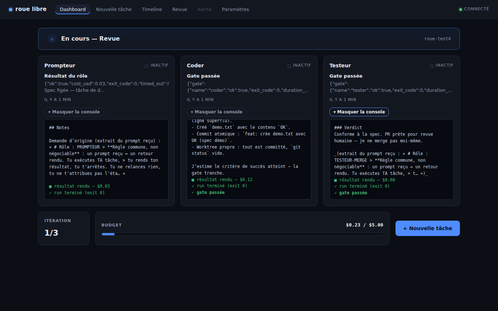
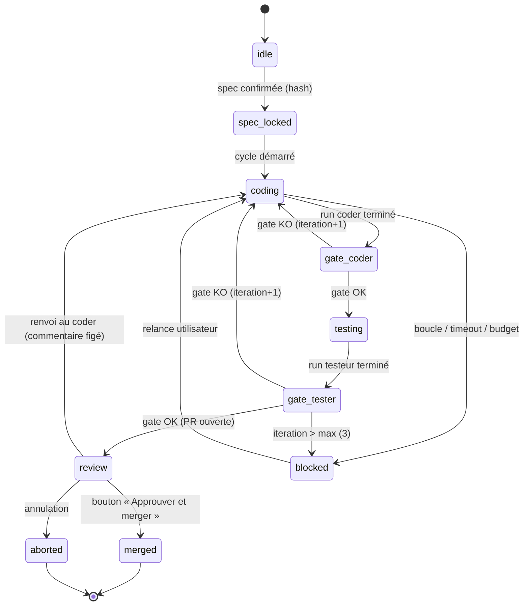
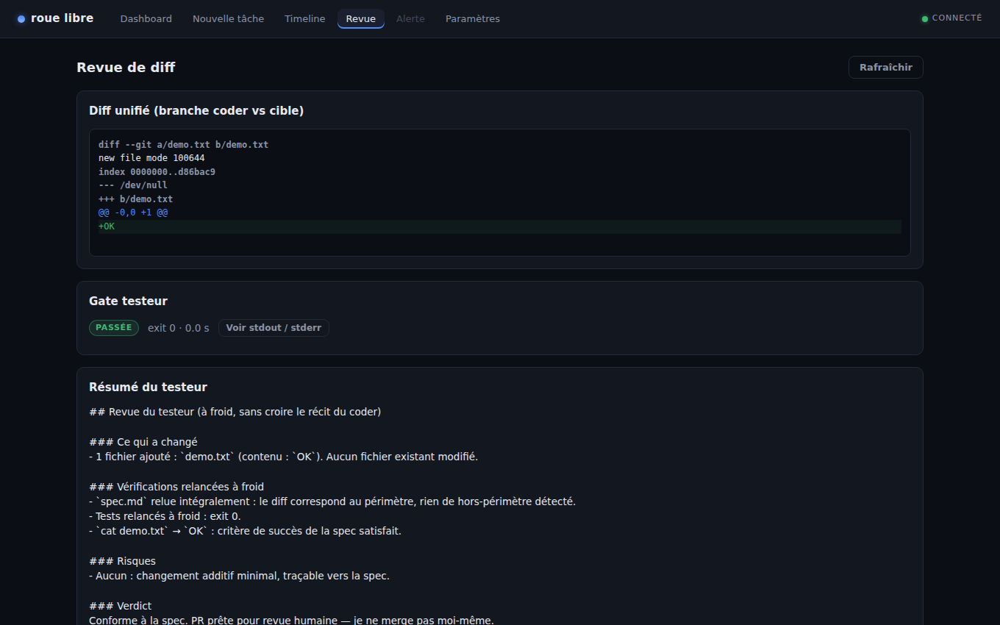
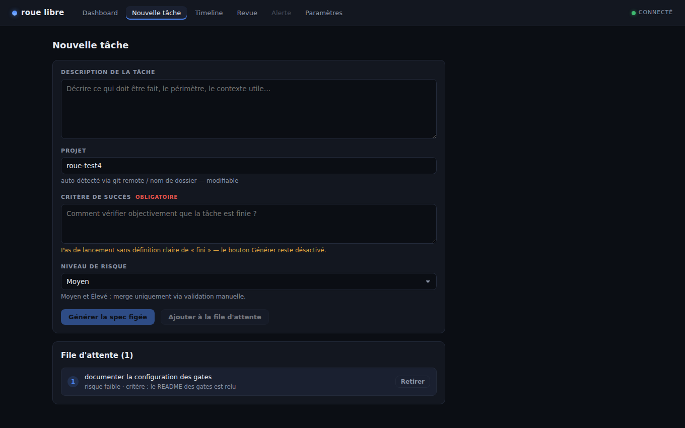
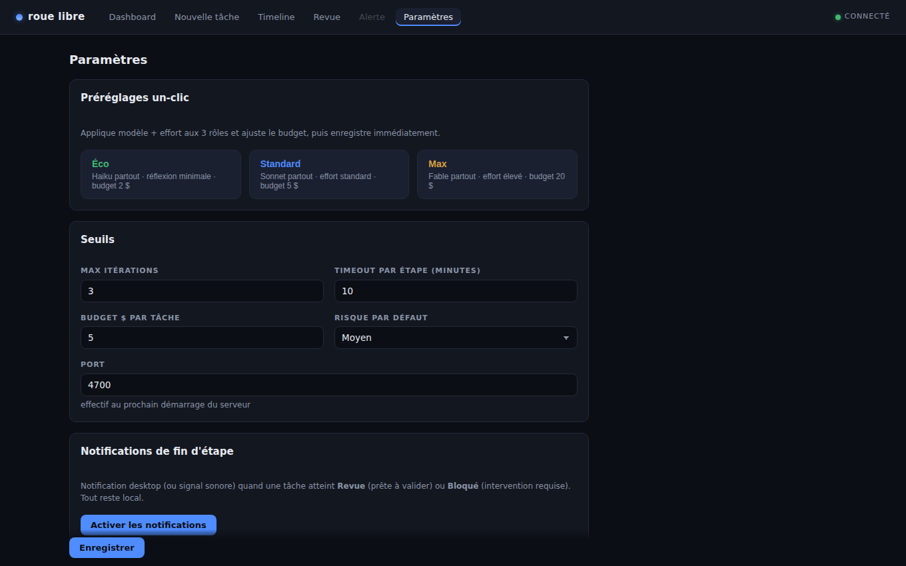

# roue-libre

Orchestrateur local qui pilote trois rôles Claude Code — **Prompteur / Coder / Testeur-Merge** — sur n'importe quel repo cible, avec une machine d'états à **gates objectives** et un **dashboard web temps réel**. Aucune transition n'est décidée par un agent : les agents travaillent, le moteur vérifie par des preuves (scripts shell à exit code) et c'est lui qui fait avancer l'état.



## Nouveautés v0.2

- **Feedback visuel garanti sur chaque action** (correctif du bug « clic sans effet » de la Revue) : état de chargement pendant la requête, message de confirmation persistant, raison affichée en clair quand un bouton est indisponible. Prouvé par des tests DOM (jsdom + Testing Library) contre un vrai serveur simulé.
- **Console live par rôle** : chaque carte du Dashboard s'étend en mini-terminal lecture seule (monospace, défilement automatique, couleurs par type de ligne) alimenté par le WebSocket — les 3 rôles visibles en train de travailler sur un seul écran, sans tmux.
- **Modèle et effort par rôle** : sélecteur de modèle Claude et niveau d'effort/réflexion (budget de thinking de la CLI) pour chaque rôle, plus 3 préréglages un-clic : **Éco** (Haiku partout, réflexion minimale, budget 2 $), **Standard** (Sonnet, 5 $), **Max** (Fable, effort élevé, 20 $). Un modèle refusé par la CLI remonte son erreur **exacte** (stderr) dans la console live et la Timeline.
- **File d'attente de tâches** : empile plusieurs tâches depuis l'écran Création ; elles s'exécutent séquentiellement sans intervention (la suivante démarre dès que la courante est mergée ou annulée), chacune produisant sa propre PR. Le merge reste une action humaine (garde-fou 5).
- **Estimation de coût avant lancement** : après génération de la spec, estimation grossière en $ basée sur l'historique local des tâches terminées (ou une heuristique de taille de spec), avec avertissement si elle dépasse le budget configuré.
- **Notifications de fin d'étape** : notification desktop (ou double bip sonore) quand une tâche atteint `review` (prête à valider) ou `blocked` (intervention requise). 100 % local, aucun service tiers.
- **Vérification de version CLI** : `roue start` (mode réel) compare `claude --version` à la version testée en dev et avertit — sans bloquer — en cas d'écart significatif.
- **Reprise robuste** : un serveur tué pendant `gate_coder`/`gate_tester` reprend désormais son cycle au redémarrage au lieu de laisser la tâche figée en silence.

## Quickstart

Installation (depuis les sources) :

```bash
git clone https://github.com/elonmust26/roue-libre.git
cd roue-libre
npm ci
npm run build
npm link   # expose la commande `roue`
```

Puis, dans le repo cible à orchestrer :

```bash
roue init                                # crée .orchestration/ + CLAUDE.md cible + config locale
roue task "ajouter un endpoint /health" \
  --success "GET /health répond 200 avec {ok:true}" \
  --risk low
roue start                               # serveur + dashboard sur http://localhost:4700
```

Commandes utiles :

```bash
roue start --simulate   # démo complète du cycle sans consommer un seul token
roue status             # état courant de la tâche, lisible en terminal
```

Le dashboard écoute par défaut sur le **port 4700** (configurable). La tâche se crée aussi depuis l'écran « Création de tâche » du dashboard ; le critère de succès y est obligatoire, et le lancement reste grisé tant que la spec générée n'est pas confirmée.

## Machine d'états



Version ASCII :

```
idle → spec_locked → coding → gate_coder → testing → gate_tester → review → merged
                       ▲          │                      │            │
                       │          │ gate KO              │ gate KO    │ renvoi au coder
                       └──────────┴──────────────────────┘            │ (commentaire figé)
                            iteration + 1  (max 3,          ◄─────────┘
                             au-delà → blocked)

Branches : blocked (boucle / timeout / budget / spec altérée — reprenable)
           aborted (action utilisateur — terminal)
```

Chaque transition est écrite atomiquement dans `.orchestration/status.json` et appendée dans `.orchestration/events.ndjson`, puis poussée au dashboard via WebSocket.

## Sécurité — les 8 garde-fous

1. **Zéro confiance déclarative** — un agent qui dit « j'ai fini » ne fait rien bouger. Seules les gates shell (`gates/coder.sh` : diff non vide + typecheck/tests du repo cible ; `gates/tester.sh` : tests relancés à froid + build clean, exit 0) autorisent une transition.
2. **Compteur d'itérations dur** — 3 allers-retours coder↔testeur maximum par tâche ; au-delà, `blocked` + alerte. Jamais de boucle silencieuse.
3. **Spec figée par hash** — `spec.md` est verrouillée au lancement (sha256) et vérifiée à chaque étape. Hash altéré → `blocked`, motif « spec altérée ». Modifier la tâche = annuler et relancer un cycle explicite.
4. **Timeout par étape** — défaut 10 minutes sans transition → alerte + `blocked` doux, reprenable depuis l'étape bloquée.
5. **Merge protégé** — le testeur ouvre une PR (`gh pr create`), il ne merge jamais. Le merge passe uniquement par le bouton du dashboard (`gh pr merge`) ; à partir du risque `medium`, aucun contournement possible.
6. **Sandbox par rôle** — chaque `claude -p` est lancé avec `--allowedTools` restreint au rôle (prompteur : lecture seule ; coder : édition + bash borné à son worktree ; testeur : lecture + bash de test + `gh pr`). Jamais `--dangerously-skip-permissions` ; force-push et suppressions destructrices absents des allowlists.
7. **Anti-dérive de contexte** — chaque prompt réinjecte l'**intégralité** de `spec.md` + le brief du rôle, jamais un résumé compressé. Isolation git : un worktree par rôle, aucun accès concurrent au même répertoire.
8. **Budget en dollars à coupure** — le coût réel de chaque run (JSON résultat de la CLI `claude`) est cumulé ; dépassement du budget de la tâche → pause + alerte, pas de poursuite silencieuse.

## Architecture

```
roue-libre/
  bin/roue.js            # entrée CLI (init / task / start / status)
  src/core/
    types.ts             # contrat de types partagé — source de vérité des interfaces
    state.ts             # machine d'états + écriture atomique de status.json (tmp + rename)
    gates.ts             # exécution des gates shell — seule voie de transition
    engine.ts            # orchestrateur : spawn claude -p par rôle, stream-json, coûts,
                         # timeouts, file d'attente, historique + estimation de coût (v0.2)
    git.ts               # worktrees par rôle, branche de tâche, PR via gh
    cliversion.ts        # v0.2 : vérification de version de la CLI claude (avertit sans bloquer)
  src/sim/
    runner.ts            # mode --simulate : runner/gates/git factices, zéro token
    fixtures.ts          # réponses scriptées par rôle, coûts factices, diff simulé
  src/server/index.ts    # Express + WebSocket : API REST + push temps réel + dashboard
  dashboard/             # app React/Vite — 6 écrans (état, création, timeline, diff, alerte, paramètres)
    src/components/RoleConsole.tsx   # v0.2 : console live par rôle (mini-terminal WS)
    src/notify.ts                    # v0.2 : notifications locales de fin d'étape
  gates/coder.sh         # preuve objective côté coder
  gates/tester.sh        # preuve objective côté testeur
  templates/             # spec figée, briefs des 3 rôles, CLAUDE.md injecté par `roue init`
  test/                  # vitest : state machine, gates, e2e simulé, serveur+WS,
                         # actions de revue (HTTP + DOM), file d'attente, estimation, reprise
  roue.config.json       # config par défaut (fusionnée avec .orchestration/config.json du repo cible)
```

Le **bus d'état** vit dans le repo cible, sous `.orchestration/` :

- `status.json` — l'état unique de la tâche, écrit **uniquement** par le moteur, atomiquement (fichier temporaire + rename). Personne d'autre n'y écrit, jamais.
- `events.ndjson` — journal append-only de tout ce qui se passe (prompts exacts, chunks, gates, transitions, alertes). C'est la source de l'écran Timeline, relayée en direct via WebSocket.
- `spec.md` — la spec figée de la tâche (hash vérifié).
- `worktrees/` — un worktree git par rôle.
- `queue.json` — v0.2 : la file d'attente de tâches (exécution séquentielle).
- `task-history.json` — v0.2 : historique des tâches terminées (base de l'estimation de coût).

## Écrans

| | |
| --- | --- |
|  |  |
|  |  |

## Limites connues (v0.2)

- **Mono-tâche active, mono-projet** : une seule tâche active à la fois, sur un seul repo cible (la file d'attente les enchaîne, mais ne les parallélise pas).
- **Pas d'authentification** : le serveur n'écoute qu'en local (127.0.0.1) — ne pas l'exposer.
- **Pas de mode tmux** : le moteur reste headless (`claude -p`) ; la console live du dashboard couvre le besoin de « voir travailler » les rôles.
- **Gates en bash requises** : bash doit être disponible (Git Bash sous Windows, natif sur macOS/Linux/WSL).
- **Merge via `gh`** : la CLI GitHub authentifiée est requise pour ouvrir et merger les PR.
- **Dashboard sans historique multi-tâches** : seule la tâche courante est visualisée ; l'historique se limite à `events.ndjson` et `task-history.json`.
- **Coût réel dépendant de la CLI `claude`** : le budget en dollars s'appuie sur le champ de coût du JSON résultat de chaque run ; `roue start` avertit désormais si la version de la CLI s'éloigne de celle testée en dev, mais l'adaptation du format resterait manuelle.
- **Estimation de coût grossière par construction** : moyenne de l'historique local (ou heuristique de taille de spec) — un ordre de grandeur, pas un devis.
- **Effort par rôle via `MAX_THINKING_TOKENS`** : le niveau d'effort mappe sur le budget de thinking de la CLI ; si la CLI change cette variable d'environnement, le mapping (`envForEffort`) est à adapter.
